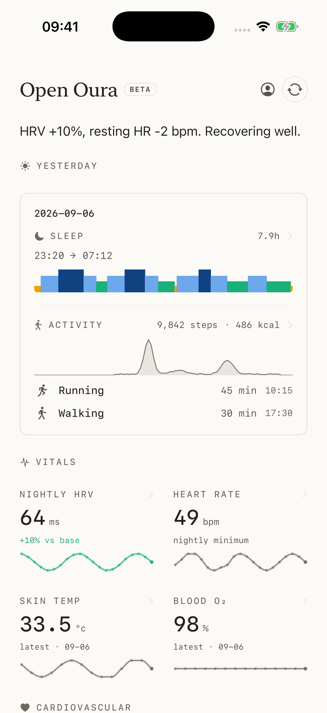
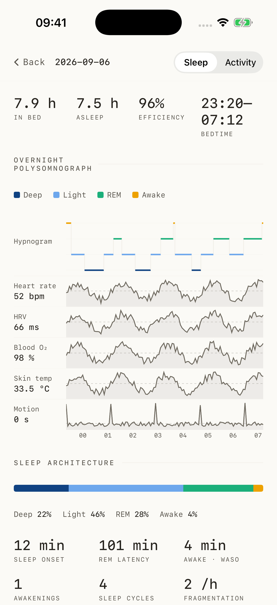
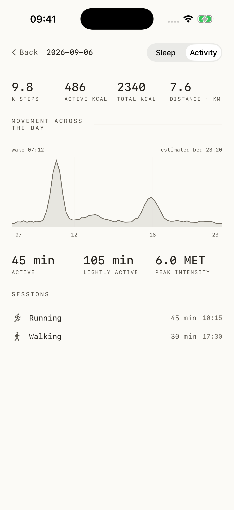

# Open Health

Your health data, on your own devices.

A native iOS app and local web dashboard for Oura: sleep, activity, heart rate,
HRV and long-term trends. Built with SwiftUI and Rust, with direct Bluetooth sync
and on-device analysis.

<p align="center">
  
  
  
</p>

<p align="center"><sub>iOS · Overview, sleep and activity · Demo data</sub></p>

The web dashboard also brings together local blood reports and DNA analysis.
Ring communication and portable algorithms are powered by
[open_oura](https://github.com/Th0rgal/open_oura).

## Get started

**iOS** — [Build with Xcode](apps/ios/TESTFLIGHT.md) or [Xcode Cloud](apps/ios/XCODE_CLOUD.md).

**Web** — Run locally, then open [localhost:8090](http://127.0.0.1:8090):

```sh
cargo run --release -p oura-cli -- dashboard
```

[Dashboard guide](dashboard/README.md) · [Algorithms](docs/algorithms/README.md) · [Architecture](docs/clients-web-and-ios.md)
